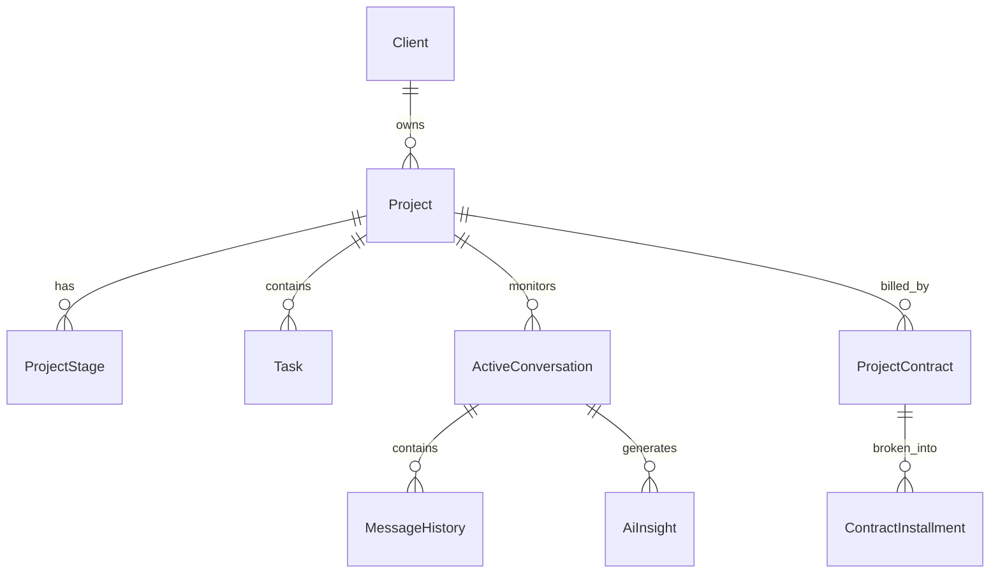

# Guia Técnico: Preenchimento de Banco de Dados para Dashboard

Este documento orienta o time técnico sobre como preencher as tabelas do banco de dados para que o Dashboard do cliente apareça corretamente, com todas as métricas de IA, cronogramas e dados financeiros.

---

## 1. Estrutura de Base (Autenticação e Escopo)

Para que o cliente consiga logar e visualizar seus dados, é necessário o preenchimento inicial destas duas tabelas:

### Tabela `Client`
Representa a conta do cliente.
- **`email`**: Deve ser o e-mail que o cliente usa para login.
- **`passwordHash`**: Hash da senha.
- **`role`**: Deve ser `CLIENT`.
- **`segment`, `operationSize`**: Informações de perfil exibidas em briefings.

### Tabela `Project`
Todo cliente (`clientId`) deve ter ao menos um projeto ativo.
- **`status`**: Deve estar como `ACTIVE`.
- **`startDate`**: Data de início (usada como âncora para o Gantt).
- **`funnelCount`**: Quantidade de funis contratados (exibida no card de info).
- **Links (`faqLink`, `googleSheetUrl`, `technicalBriefingUrl`)**: Se preenchidos, o sistema prioriza este projeto no dashboard.

---

## 2. Motor de Analytics (Cards e Gráficos de IA)

O dashboard analytics consome dados de três tabelas principais:

### Tabela `ActiveConversation`
Representa uma conversa única com um Lead.
- **`funnel`**: Nome do funil (ex: "Vendas", "Suporte"). Agrupa as barras no gráfico de funil.
- **`stage`**: Etapa atual do lead (ex: "Novo", "Agendado"). Define as cores e divisões internas das barras.
- **`dtUltimaMensagem`**: Usada para filtrar conversas por período (filtro de data superior).

### Tabela `MessageHistory`
Histórico bruto de mensagens.
- **`senderType`**: Use `ai` para mensagens da inteligência e `user`/`contact` para externos.
- **`createdAt`**: Usado para o gráfico de **Distribuição Horária (24h)** e para o contador de **Total de Mensagens**.

### Tabela `AiInsight`
Análise de cada conversa feita pela IA.
- **`aiHandledFully` (Boolean)**: Se `true`, incrementa a métrica de "Atendimento sem humanos".
- **`humanInterventionNeeded` (Boolean)**: Se `true`, incrementa a métrica de "Encaminhamento para humano".
- **`sentimentLabel`**: Use `Positivo`, `Neutro` ou `Negativo` para o gráfico de sentimentos.
- **`objectionsDetected`**: Lista de strings (ex: `["Preço", "Prazo"]`). Alimenta o gráfico de "Principais Objeções".
- **`intentDetected`**: String com a intenção (ex: `"Deseja comprar"`). Alimenta as métricas de intenção.

---

## 3. Cronograma e Execução (Gantt)

O Gantt e o Checklist dependem da relação entre o Projeto e suas Etapas/Tarefas:

### Tabelas `ProjectStage` e `Task`
- **`ProjectStage`**: Deve ter `stageNumber` de 1 a 7.
- **`Task`**: Deve estar vinculada ao projeto. O sistema usa o `plannedStart` e `plannedEnd` das tarefas para desenhar as barras no Gantt.
- **Relação**: As tarefas com `isCompleted: true` atualizam o status visual do checklist.

---

## 4. Módulo Financeiro (Admin/Financeiro)

Para que os relatórios de faturamento e fluxo de caixa funcionem:

### Tabela `ProjectContract`
- **`signatureDate`, `paymentStartDate`**: Definem o início das projeções.
- **`durationMonths`**: Quantidade de meses de contrato.

### Tabela `ContractInstallment`
Cada contrato deve ter parcelas (`installments`) associadas.
- **`monthIndex`**: O mês relativo (0 para o primeiro mês, 1 para o segundo...).
- **`monthlyFeeValue`**: O valor recorrente (MRR).
- **`implementationValue`**: Valor único de setup (no mês 0).

### Tabela `Expense`
Gastos internos da empresa.
- **`amount`**: Valor da despesa.
- **`type`**: `RECURRING` ou `ONE_TIME`.
- **`date`**: Data do vencimento/pagamento para o fluxo de caixa.

---

## 5. Resumo de Relações (Mermaid)

---

> [!IMPORTANT]
> Para testes rápidos de visualização, utilize a data de criação (`createdAt`) e `dtUltimaMensagem` dentro dos últimos 30 dias, pois este é o filtro padrão do Dashboard.
